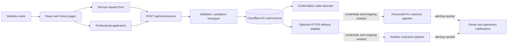
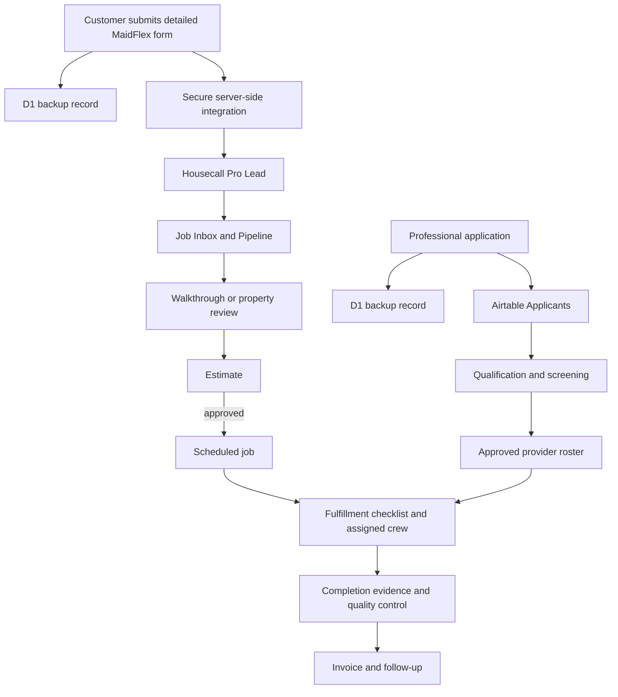

# MaidFlex Pro Developer Handoff

Prepared for the developer taking ownership of the MaidFlex Pro website and integrations.

## Executive summary

This is a real, working MVP—not a disposable visual mockup. The routes render, the design is responsive, the forms validate, the server endpoint persists submissions to Cloudflare D1, and the lint, test, and production-build checks pass.

The operational foundation is in place: saved submissions can be sent through a secure server-side HTTPS adapter, and D1 records whether delivery is not configured, pending, delivered, or failed. The remaining gap requires account-level setup: choose and authorize the destination, map customer requests into Housecall Pro, map professional applications into Airtable, and turn on owner notifications.

The inheritance cleanup is complete: unused starter components are gone, forms have explicit accessible labels, internal links use framework navigation, validation is isolated and tested, and GitHub automatically runs lint, tests, and the production build. Remaining debt is bounded: the homepage and global stylesheet are large, the delivery adapter still needs an asynchronous retry queue for higher volume, and there is no browser-level test suite yet. None of this requires a rebuild.

## Business model encoded in the site

The website intentionally supports three different journeys:

1. **Richmond commercial:** facility managers request a walkthrough and a scoped recurring-cleaning proposal.
2. **Rockies vacation rentals:** owners and property managers request a turnover plan based on property count, windows, linens, access, and operating details.
3. **Cleaning professionals:** independent cleaning businesses apply for opportunities in supported markets.

Do not combine the customer and contractor pipelines. Housecall Pro should own customer leads and service delivery. Airtable should own the applicant and approved-provider roster.

## Current architecture

### Application layer

- `app/page.tsx`: primary brand and market-selection page
- `app/commercial/richmond/page.tsx`: Richmond commercial funnel
- `app/vacation-rentals/rockies/page.tsx`: Rockies turnover funnel
- `app/cleaners/apply/page.tsx`: cleaning-professional funnel
- `app/request-form.tsx`: shared customer intake form, configured by market
- `app/professional-application.tsx`: applicant form
- `app/api/submissions/route.ts`: validation and persistence endpoint
- `lib/submission-validation.ts`: shared validation and sanitation rules
- `lib/submission-delivery.ts`: optional secure routing adapter
- `app/site-shell.tsx`: shared navigation and footer on market pages
- `app/globals.css`: layout and visual system
- `tests/submission-validation.test.ts`: unit coverage for all intake types
- `.github/workflows/quality.yml`: pull-request and main-branch quality gate

### Data layer

The `submissions` D1 table stores:

- submission ID and human-facing confirmation number;
- type: `service` or `professional`;
- status: `new`, `contacted`, `qualified`, or `closed`;
- market and contact details;
- organization when applicable;
- sanitized market-specific fields as JSON;
- external delivery status, attempt count, failure reason, and returned record ID;
- creation timestamp.

The API rejects unsupported request types or markets, missing required fields, invalid-looking contact details, oversized payloads, and non-JSON requests. A hidden website field acts as a basic spam trap. If persistence fails, the visitor is shown the business phone number. If external delivery fails after persistence, the visitor still receives a confirmation number and the D1 record is marked for recovery.

There is no authentication-protected admin view. Operational users should work in Housecall Pro and Airtable instead of building a second CRM inside this website.

## Target operating architecture

### Recommended systems of record

| Function                   | System                         | Purpose                                                     |
| -------------------------- | ------------------------------ | ----------------------------------------------------------- |
| Public experience          | This React/Vinext site         | Marketing, qualification, and intake                        |
| Customer sales and service | Housecall Pro                  | Leads, estimates, jobs, customers, invoices                 |
| Contractor recruiting      | Airtable                       | Applications, screening, coverage, documents, roster status |
| Automation                 | Zapier                         | Routing, alerts, record creation, and cross-system updates  |
| Raw submission backup      | Cloudflare D1                  | Durable website intake and recovery trail                   |
| Sensitive documents        | Secure e-sign/document service | Contracts, W-9s, insurance, and compliance files            |
| Measurement                | GA4 and Search Console         | Acquisition, funnel conversion, and search visibility       |

Confirm Housecall Pro plan entitlements and API access before implementation. If the account supports creating Leads through the API, preserve the existing detailed forms and create the HCP Lead server-side. The native HCP lead form is a faster fallback, but it is less flexible and should not replace the detailed MaidFlex intake unless speed outweighs qualification depth.

Do not assume the standard Housecall Pro Zapier connector can create or trigger on Leads. If Lead events are available on the selected HCP plan, use HCP webhooks such as `lead.created` with Zapier Webhooks or a small integration worker. Keep customer creation, lead creation, and job creation as separate operations with explicit failure handling.

The implemented adapter contract and setup steps are in [INTEGRATION_SETUP.md](INTEGRATION_SETUP.md).

## Implementation priorities

### P0 — make every submission operational

#### 1. Route customer requests into Housecall Pro

**Foundation complete:** detailed forms, D1-first persistence, an HTTPS destination adapter, idempotency and confirmation headers, and delivery-state tracking are implemented. The account-specific HCP endpoint, field mapping, and credentials remain.

Recommended approach:

1. Keep the current Richmond and Rockies forms.
2. Save to D1 first so MaidFlex retains a recovery record.
3. Create or update the customer and create a Lead in Housecall Pro through a server-side integration.
4. Include source, market, contact data, property/facility details, and the MaidFlex confirmation number.
5. Put the Lead in the correct Job Inbox/Pipeline stage.
6. Send an immediate internal alert with a direct link to the HCP record.

Acceptance criteria:

- A Richmond form creates one Richmond-tagged HCP lead.
- A Rockies form creates one Rockies-tagged HCP lead.
- Every lead contains the original `MFP-...` confirmation number.
- Retries do not create duplicate HCP leads.
- The D1 record indicates delivered, pending, or failed integration status.
- A failed delivery alerts the owner and preserves enough data to recover manually.
- Credentials exist only in server-side environment configuration.

#### 2. Route professional applications into Airtable

**Foundation complete:** professional applications use the same D1-first adapter and are distinguishable by `kind: professional`. The Airtable base, field mapping, credentials, and notification destination remain.

Recommended Airtable tables:

- `Applicants`
- `Approved Providers`
- `Market Coverage`
- `Compliance Documents` or secure links to those documents

Acceptance criteria:

- Each application creates one Airtable applicant record with the MaidFlex confirmation number.
- Market, radius, experience, team size, insurance status, availability, equipment, and screening answers map to explicit fields.
- New applications notify recruiting/operations.
- Status changes are auditable.
- Contractor applicants never appear in Housecall Pro as customer leads.
- Sensitive documents are requested only after qualification through a secure workflow.

#### 3. Add delivery state, alerts, and recovery

**Partially complete:** the data model now distinguishes `not_configured`, `pending`, `delivered`, and `failed`; stores the attempt count, returned external ID, delivery time, and limited failure reason; and avoids logging submitted personal data. The current adapter makes one bounded attempt. Add an asynchronous queue or scheduled retry and an operator-visible recovery view before high-volume use.

Acceptance criteria:

- Integration errors are logged without exposing private form contents unnecessarily.
- Failed deliveries are retried safely or placed in a visible recovery queue.
- The owner receives an actionable failure notification.
- A test submission can be traced end to end by confirmation number.

#### 4. Connect and verify `maidflexpro.com`

Acceptance criteria:

- The apex domain and chosen `www` behavior resolve consistently over HTTPS.
- Canonical and social metadata use the production domain.
- Every primary route, form, phone link, email link, privacy page, and terms page is tested on the domain.
- Old preview URLs redirect where the hosting platform permits.

### P1 — make the repository easy to maintain

#### 1. Quality baseline — complete

- `pnpm run lint` exits successfully.
- Form labels are explicitly associated with their controls.
- Internal route navigation uses the framework link component.
- Unused starter UI components and their unused mobile hook have been removed.
- Source is formatted with the repository formatter.

#### 2. Reduce rapid-build debt

- Split the homepage into named, testable sections.
- Break `globals.css` into a small token/base layer plus page or component styles when doing so reduces real maintenance cost.
- Preserve the brand imagery and the distinct Richmond/Rockies positioning during refactors.

#### 3. Expand tests and continuous integration

**Initial baseline complete:** validation and sanitation have unit coverage, and GitHub runs lint, unit tests, and the production build on pull requests and pushes to `main`.

Minimum useful coverage:

- API route integration tests
- Richmond service-form success and failure paths
- Rockies service-form success and failure paths
- Professional-application success and failure paths
- Route smoke tests
- Browser-level accessibility and route smoke tests

Acceptance criteria:

- Pull requests run install, lint, tests, and build.
- Test credentials and live CRM records are not required for ordinary pull-request checks.
- Integration calls use mocks or a sandbox account outside production.

### P2 — instrument growth and strengthen the funnel

- **Complete:** generated `sitemap.xml` and `robots.txt`
- **Complete:** structured business/service data and route metadata
- Install GA4 and connect Search Console.
- Track market selection, primary CTA clicks, form starts, form errors, successful submissions, phone clicks, and email clicks.
- Validate social previews against the production domain.
- Optimize image formats and loading without degrading brand quality.
- Add conversion-focused market content only when operations can fulfill the demand it creates.

## Zapier workflow blueprint

### Zap 1 — new customer lead

**Trigger:** a lead is created or delivered to Housecall Pro.

**Paths:**

- Richmond commercial
- Rockies vacation rental
- Unclassified/manual review

**Actions:**

1. Normalize market and source fields.
2. Notify the appropriate sales/operations channel immediately.
3. Create the first-response task with a one-business-day ceiling; use a shorter service-level target during staffed hours.
4. Write the HCP record ID and delivery timestamp back to D1 through a secure internal endpoint or integration worker.
5. Escalate if the lead has not moved from `new` within the agreed response window.

### Zap 2 — estimate or job becomes ready for fulfillment

**Trigger:** estimate approved, job created, or the closest available HCP event.

**Actions:**

1. Create/update an operations record keyed by the HCP job ID.
2. Apply the correct Richmond commercial or Rockies turnover checklist.
3. Surface date, access, scope, supplies, special requirements, and required completion evidence.
4. Alert the coordinator to assign from the approved-provider roster.

### Zap 3 — job lifecycle and quality control

**Trigger:** job scheduled, rescheduled, completed, or canceled.

**Actions:**

1. Update the operations record.
2. Notify the assigned coordinator/provider when action is required.
3. On completion, confirm checklist and photo/evidence requirements.
4. Flag exceptions for review before invoice follow-up.

### Zap 4 — new cleaning-professional application

**Trigger:** new Airtable applicant record created by the website integration.

**Actions:**

1. Notify recruiting/operations.
2. Score or classify the application using explicit business rules.
3. Create the correct follow-up task: decline, clarification, interview, or document request.
4. Move qualified applicants toward the approved-provider roster without collecting sensitive documents in the public site.

## Security and privacy requirements

- Never expose Housecall Pro, Airtable, Zapier, email, or analytics secrets in client code.
- Keep the public repository free of `.env` files and exported production records.
- Minimize personal data in logs and notifications.
- Protect any internal callback used to update D1 delivery state.
- Add rate limiting or stronger bot protection if spam appears; the honeypot is a baseline, not a complete abuse-control system.
- Define a retention policy for rejected applicants and stale customer inquiries.
- Use role-appropriate access for HCP, Airtable, hosting, analytics, and GitHub.
- Keep W-9s, insurance certificates, government IDs, banking details, and background-check materials out of this repository and the public intake endpoint.

## Git and release workflow

1. Branch from `main` using a short purpose-based branch name.
2. Keep generated build output, local environment files, and credentials untracked.
3. Open a pull request that explains the user-facing and operational impact.
4. Require the existing GitHub lint, test, and production-build job to pass before merge.
5. Verify forms on the deployed preview with non-sensitive test data.
6. Merge, deploy through the managed Sites project, and run the production smoke checklist.

Do not delete or recreate `.openai/hosting.json` casually: it associates this repository with the managed Sites project. Do not change package managers or discard `pnpm-lock.yaml` without an intentional migration.

## Production smoke checklist

- Home, Richmond, Rockies, cleaning-professional, privacy, and terms routes load.
- Navigation and all primary CTA buttons reach the intended route or form.
- Phone and email links open correctly.
- Richmond form succeeds and appears in D1 and HCP once integrated.
- Rockies form succeeds and appears in D1 and HCP once integrated.
- Professional application succeeds and appears in D1 and Airtable once integrated.
- Each test produces one record, one confirmation number, and the expected notification.
- Invalid data shows a useful error without losing the entire form.
- Mobile layouts have no horizontal overflow.
- Metadata, canonical URLs, social image, analytics, and conversion events use the production domain.

## Suggested first three development sessions

### Session 1: connect the accounts

- Confirm Housecall Pro plan/API access and Airtable ownership.
- Choose a Zapier Catch Hook or MaidFlex integration endpoint.
- Configure the two server-side environment values described in `INTEGRATION_SETUP.md`.
- Build the Housecall Pro and Airtable field mappings.

### Session 2: verify the operating loop

- Demonstrate one Richmond request, one Rockies request, and one professional application end to end.
- Verify owner notifications, external record IDs, and duplicate prevention.
- Force a delivery failure and confirm the record can be recovered from D1.

### Session 3: prepare fulfillment automation

- Add the first-response escalation and delivery-retry workflow.
- Connect approved HCP estimates/jobs to the fulfillment checklist and provider roster.
- Add browser-level route and form tests around the deployed preview.

At that point MaidFlex Pro will have the essential loop: demand enters, the right operator sees it, fulfillment can be organized, and failures are visible instead of silent.
